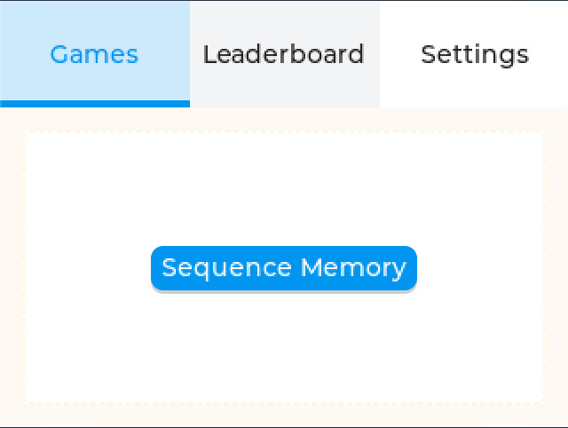
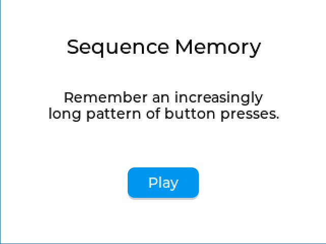
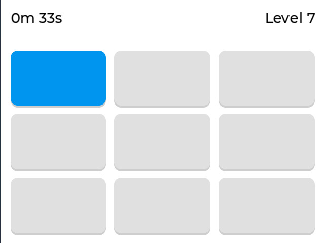

# `Silly`

Silly is an open-source mini-game platform for an ESP32 touchscreen device.
The project aims to provide a reusable foundation where games can be added as
small, self-contained modules instead of rebuilding navigation, lifecycle,
display and session management for every game.

> [!WARNING]
> Silly is currently in early alpha. Features, APIs and hardware configuration
> may change and bugs should be expected.

## Current functionality

The current firmware provides:

- Initialization for an ILI9341 display and an FT5x06-compatible touch
  controller
- LVGL-based UI flow
- Catalog-driven game menu
- Shared game lifecycle
- Playable single-player game

## Screenshots





## Project goals

The immediate goal is to make adding single-player games predictable and
well-documented. Game implementations are kept independent of LVGL and ESP-IDF so they can
be tested and reused by other frontends.

Possible future work includes:

- Bluetooth/Internet multiplayer between devices
- Online leaderboards and social features
- Bluetooth or local play as a fallback when an internet connection is not
  available
- Larger collection of reusable UI components

These items describe the intended direction and are not part of the current
alpha release.

## Architecture

The code is divided into a few main areas:

```text
src/
├── app/        # Application controller, navigation commands and errors
├── game/       # Game lifecycle, session, catalog, rules and game views
├── hardware/   # ESP32 display, touch and board configuration
└── ui/         # Shared views, view hosting, factories and components
```

See [Adding a game](docs/ADDING_A_GAME.md) for the complete workflow and
completion checklist.

## Hardware configuration

The current board configuration targets:

- ESP32-S3
- 240 × 320 ILI9341 display over SPI
- FT6336G touch controller using the FT5x06-compatible I²C protocol

Pin assignments and display options are defined in
[`hardware/board_config.h`](main/src/hardware/board_config.h). Review
that file before flashing the firmware to different hardware.

## Requirements

Firmware development requires:

- ESP-IDF 5+
- CMake and Git
- Supported display and touch-controller setup or adjusted board
  configuration

Project dependencies are managed through the ESP-IDF Component Manager.

## Building the firmware

Activate your ESP-IDF environment, then run:

```sh
idf.py set-target esp32s3
idf.py build
```

To flash a connected device and open its serial monitor:

```sh
idf.py flash monitor
```

The exact serial port can be supplied with `-p` when automatic detection is not
appropriate.

## Running the tests

```sh
cmake -S tests -B build-tests -DCMAKE_BUILD_TYPE=Debug
cmake --build build-tests --parallel
ctest --test-dir build-tests --output-on-failure --no-tests=error
```

## Adding a game

Start with [docs/ADDING_A_GAME.md](docs/ADDING_A_GAME.md). It describes:

- Expected module layout
- Lifecycle responsibilities
- Separation between rules and presentation
- Catalog registration
- Required tests
- Completion checklist for a new game

In short, adding a game should involve implementing its rules, view,
registration descriptor and tests. The shared menu and session infrastructure
then discover and run it through the catalog.

## Useful references

- [Adding a game](docs/ADDING_A_GAME.md)
- [Board configuration](main/src/hardware/board_config.h)
- [Game lifecycle interface](main/src/game/game.h)
- [Game catalog](main/src/game/game_factory.h)
- [Sequence game implementation](main/src/game/sequence/sequence_game.cpp)
- [Sequence game tests](tests/sequence_game_test.cpp)
